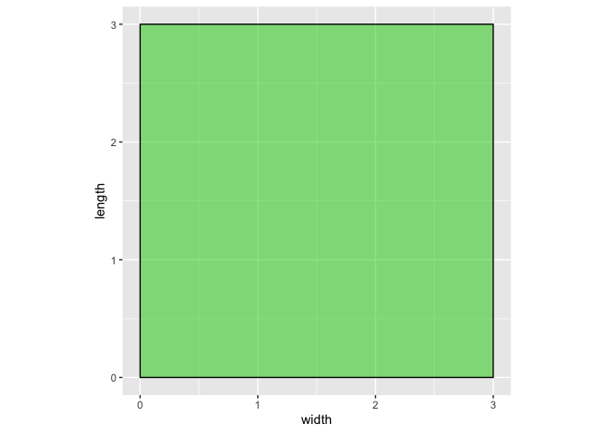
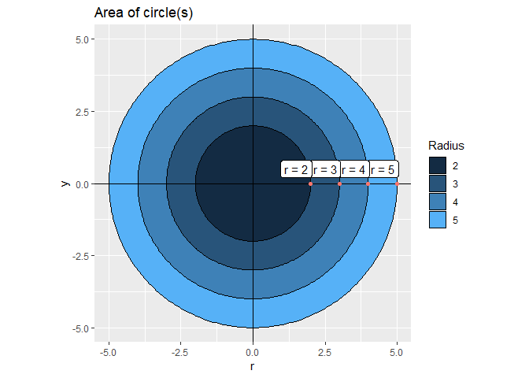
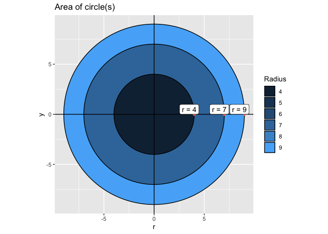
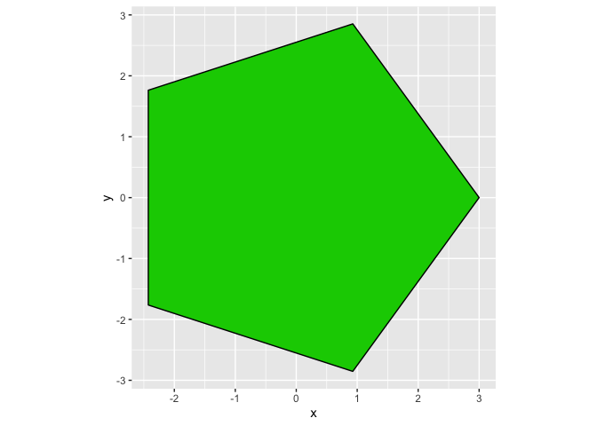
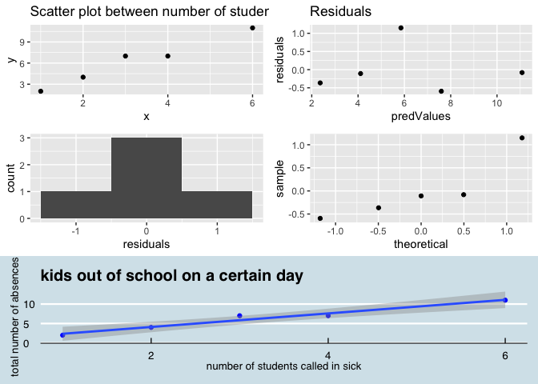

<!-- README.md is generated from README.Rmd. Please edit that file -->
schoolR </a>
====================================================================

<!-- badges: start -->
[](https://travis-ci.org/sunniraleigh/schoolR) <!-- badges: end -->

An R package that provides a simple and accessible approach for elementary through high school students and their educators to engage in R and solidify their understanding of mathematical concepts.

Installation
------------

To install, run the following code:

``` r
devtools::install_github("sunniraleigh/schoolR") 
#> Skipping install of 'schoolR' from a github remote, the SHA1 (bce27ba4) has not changed since last install.
#>   Use `force = TRUE` to force installation
library(schoolR)
```

Getting Started
---------------

For a more detailed guide about what functions do and exmaples about how to use them, see the [vignette](./vignettes/schoolR.Rmd).

Usage
-----

This package should be used in a classroom setting as a supplemental material for math courses, or as part of an R group dedicated to teaching younger students. It provides functions to help students develop a deeper understanding of how area is caclulated, and how to analyze trends in graphs. This package also lets teachers produce practice problems, while specifying the operation, number of problems to generate, and magnitude of numbers involved. It will be used by teachers and students in collaboration. It will allow students to begin understanding more complex, big picture math concepts by using R without having to first learn all of the details of coding.

### Drawing squares with `square()`

`square` allows the user to input a numeric vector that defines the length of each side of the square. The function will output a visualization of the square and a tibble with calculation of its length, width, area and perimeter

``` r
# input a single length 
square(3)
#> # A tibble: 1 x 4
#>   length width  area perimeter
#>    <dbl> <dbl> <dbl>     <dbl>
#> 1      3     3     9        12
```



``` r

# input a vector
square(3:6)
#> # A tibble: 4 x 4
#>   length width  area perimeter
#>    <int> <int> <dbl>     <dbl>
#> 1      3     3     9        12
#> 2      4     4    16        16
#> 3      5     5    25        20
#> 4      6     6    36        24
```



### Draw a circle with `circle()`

`circle` allows the user to input a desired radius length which returns the respective circle visualization along with calculations of its diameter, perimeter, and area.

``` r
# input a single length
circle(3)
#>   r diameter perimeter     area
#> 1 3        6  18.84956 28.27433
```


``` r
# input a vector
circle(2:5)
#>   r diameter perimeter     area
#> 1 2        4  12.56637 12.56637
#> 2 3        6  18.84956 28.27433
#> 3 4        8  25.13274 50.26548
#> 4 5       10  31.41593 78.53982
```


``` r
# input a pre-defined vector
r <- c(4,7,9)
circle(r)
#>   r diameter perimeter      area
#> 1 4        8  25.13274  50.26548
#> 2 7       14  43.98230 153.93804
#> 3 9       18  56.54867 254.46900
```



### Create a tibble with `ngon()`

`ngon` allows the user to specify the length of a radius and the number of sides of a shape. This function then produces a tibble that contains all of the calculations.

``` r
ngon(3,5)
#> # A tibble: 1 x 5
#>   radius sides  area perimeter angle
#>    <dbl> <dbl> <dbl>     <dbl> <dbl>
#> 1      3     5  21.4      17.6  1.26
```

### Draw an polygon with `draw_ngon()`

`draw_ngon()` builds upon the `ngon` function by plotting the shape given the information for in `ngon`.

``` r
ngon(3,5) %>% draw_ngon()
```



### Graphing with `graph_my_data()`

`graph_my_data` allows students and teachers to produce high-quality graphs of data that they obtain, or of data from `data.frame`s. It outputs basic simple linear regression diagnostics such as correlation coefficients, means, and medians, and interprets the r value. This allows for a deeper understanding of general trends in data for students who likely have very little statistical background.

``` r
x <- c(1, 3, 4, 6, 2)
y <- c(2, 7, 7, 11, 4)
graph_my_data(x, y, "blue", "number of students called in sick", "total number of absences", "kids out of school on a certain day")
#> Check: is the scatterplot linear?
#> The Pearson Linear Correlation Coefficient, r, for your data is: 0.980315618063239
#> This suggests a strong positive linear correlation!
#> The zero mean condition holds!
#> Check: is there a non-linear trend in the residuals? Is there constant variance?
#> Check: is the data relatively normal?
#> The equation for your line of best fit is: Y =  0.621621621621618 +  1.74324324324324 X
#> The mean of number of students called in sick is: 3.2 and the mean of total number of absences is: 6.2
#> The median of number of students called in sick is: 3 and the median of total number of absences is: 7
#>                     r     correlation intercept    slope mean_x mean_y median_x
#> (Intercept) 0.9803156 strong positive 0.6216216 1.743243    3.2    6.2        3
#>             median_y
#> (Intercept)        7
```



### Producing Practice Problems with `generate_problems()`

`generate_problems` allows educators to produce sets of practice questions for students based on what they would like them to work on. Teachers can specify the upper and lower bounds of the numbers being chosen from to use in the equation, what operation to use, and how many problems to produce.

``` r
generate_problems("multiply", 5, 15, 10)
#>    Problem Student.Answer Correct.Answer
#> 1    5 * 6                            30
#> 2   13 * 9                           117
#> 3   9 * 11                            99
#> 4   11 * 5                            55
#> 5  12 * 12                           144
#> 6   7 * 10                            70
#> 7  10 * 14                           140
#> 8   6 * 15                            90
#> 9  15 * 13                           195
#> 10   8 * 8                            64
```

Authors
-------

Natalia Iannucci, Isabel Gomez, Sunni Raleigh
